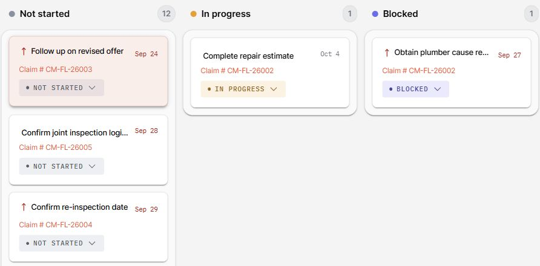

The Task Board provides a visual view of your tasks, organizing them by status. This helps you see work that is ready to start, underway, blocked, or finished.

## Understanding the Task Board Layout

The board groups tasks into five status columns:

- **Not started**
- **In progress**
- **Blocked**
- **Completed**
- **Cancelled**

Task cards show their due date and priority, with overdue work highlighted. Linked claim, lead, and goal information helps you see the context for each task. A task's status determines its column; changing its due date does not move it to another column.

Each column scrolls independently, so you can review a long list of tasks in one status while keeping the other columns in place.

## Managing Tasks

- **View Details:** Click on any task card to see its full details and make updates.
- **Update Status:** On desktop, drag a task card to another status column. You can also use the card's status menu, including on smaller screens or when using a keyboard.
- **Complete a Task:** Choose **Completed** from the status menu or move the card to the Completed column.
- **Cancel a Task:** Choose **Cancelled** and confirm the cancellation when prompted.

Status changes are available when you have permission to update the task. See [Managing Tasks](/tasks/managing-tasks/) for task details, goals, and collaboration.

## Customizing Your View

By default, the Task Board displays all five status columns, including empty ones.

- **Click the eyeball icon (`👁️`)** in the top-right corner to hide empty status columns.
- Click the icon again to show all columns.
- Task status columns remain in their fixed order.
