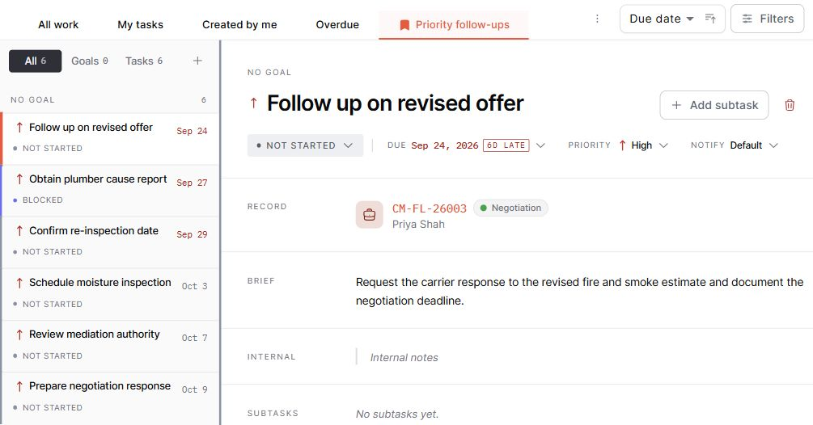

Open **Goals & Tasks** from the main menu. Choose **All**, **Goals**, or **Tasks** above the left panel, then select an item to see its details. Use **Search goals and tasks** to find work by name.

### Find and Organize Work

Choose a view to start with **All work**, **My tasks**, **Created by me**, or **Overdue**. These views help you focus on work assigned to you, work you created, or tasks past their due date.

Use the status controls to choose:

- **Open:** Not started, In progress, and Blocked tasks.
- **Done:** Completed and Cancelled tasks.
- **All:** Tasks in any status.

Open **Filters** to narrow the list by status, assignee, creator, priority, or due date. Due-date choices include overdue work, today, upcoming periods, a specific date, and a date range. Changes apply as you select them. Remove an individual filter using its chip, or use **Reset** to return to the selected view's filters.

Use the sort dropdown beside **Filters** to arrange tasks by due date, priority, title, or last updated. Use the direction control beside it to switch the order, such as soonest due or highest priority first.

### Save a View

1. Open **Filters** and choose the assignee, creator, priority, and due-date filters you want to reuse.
2. Select **Save as view…** and enter a name.
3. Select your saved view from the view tabs when you need it again.

If you change a saved view's filters, open its menu and select **Save changes to** that view. Use **Delete view** from the same menu to remove a view you no longer need.

Saved views keep the assignee, creator, priority, and due-date filters. Status selections and sorting are remembered separately and apply across views. The claim and lead **Tasks** tabs use the same filtering and sorting controls, but stay focused on that record and do not include saved-view tabs.

### Goals and Subtasks

Use the **+** beside the search box to create a goal or task. A goal groups related tasks and shows how many are complete. Select a goal to review its progress and connected work.

To break a task into smaller steps, open it and select **Add subtask**. Subtasks stay with their parent task.

### Task Details

Select a task in the left panel to open its details. Here you can:

- Change its title, status, due date, priority, and notification preference.
- Use **Brief** for the work to be done and **Internal** for team notes.
- Open the linked claim or lead from **Record**.
- Add or reassign staff in **People** and attach supporting files in **Files**.

To finish a task, open its status menu and select **Completed**. You can return to it later with **Done** or **All**.

### Working Together

Use **Discussion** to share updates and reply to teammates. Type **@** and select a task participant to mention them. In **People**, select available staff, then use **Add as…** to add collaborators or watchers. For work linked to a claim or lead, choose from the staff assigned to that record.
